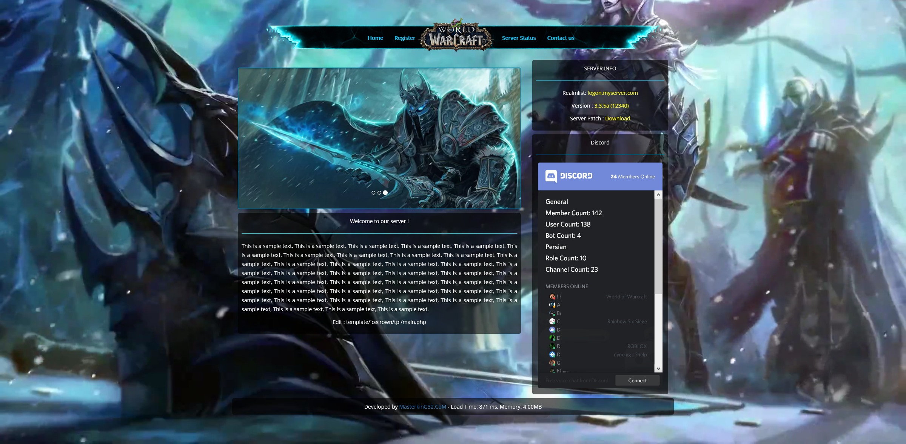

# AzerothCore Registration Portal

A player registration website for an [AzerothCore](https://www.azerothcore.org) (WotLK 3.3.5a) server, packaged to run in Docker behind [Traefik](https://traefik.io) with HTTPS.

Players can create an account, change their password, see who's online and check the top players. Accounts are written straight into `acore_auth.account` using SRP6 (salt + verifier), the same way AzerothCore does it, so you don't need to enable SOAP.

This is a Docker-focused fork of [masterking32/WoWSimpleRegistration](https://github.com/masterking32/WoWSimpleRegistration). All the PHP and the templates come from that project.



## Requirements

- **AzerothCore running in Docker** on the same machine. The portal joins AzerothCore's Docker network and connects to the `ac-database` container directly, so no MySQL port has to be exposed.
- **Traefik** running in Docker, with a `websecure` entrypoint and a `letsencrypt` certificate resolver.
- **A DNS record** pointing at the server, e.g. `register.example.com`.
- Docker with the Compose plugin.

## Setup

### 1. Clone the repo on your server

```bash
git clone https://github.com/buildthehomelab/wow-mod-azerothcore-portal.git
cd wow-mod-azerothcore-portal
```

### 2. Create your config files

```bash
cp .env.example .env
cp docker/create-db-user.sql.example docker/create-db-user.sql
```

Both files are gitignored and are not copied into the Docker image.

### 3. Pick a database password

Generate a password, e.g. with `openssl rand -base64 24`. Put it in two places:

- `DB_PASS=` in `.env`
- `CHANGE_ME` in `docker/create-db-user.sql`

### 4. Fill in `.env`

| Variable | What to set |
|---|---|
| `TRAEFIK_NETWORK` | The Docker network Traefik is on (`docker network ls`). |
| `SERVICE_NAME` | Subdomain for the site, e.g. `register`. |
| `DOMAIN` | Your domain, e.g. `example.com`. The site is served at `https://SERVICE_NAME.DOMAIN`. |
| `AC_NETWORK_NAME` | AzerothCore's network. Find it with `docker network ls \| grep ac-network`. It's usually `<azerothcore folder>_ac-network` (on TrueNAS SCALE, `ix-azerothcore_ac-network`). |
| `REALMLIST` | The address players put in `realmlist.wtf`: your server's public IP or hostname. |
| `REALM_NAME` | Realm name shown on the site. |
| `SITE_TITLE` | Title shown in the browser tab and header. |
| `TEMPLATE` | `icecrown` (default), `light`, `advance`, `kaelthas`, `battleforazeroth`, `legion` or `legion-advance`. |
| `DB_USER` / `DB_PASS` | Leave `DB_USER` as `wow_register` unless you changed it in the SQL file. |
| `SMTP_*` | Optional. Only needed for "forgot password" emails. |
| `DEBUG_MODE` | Set to `true` to show PHP errors while troubleshooting. Turn it back off afterwards. |

### 5. Create the database user

```bash
docker exec -i ac-database mysql -uroot -p < docker/create-db-user.sql
```

It prompts for your AzerothCore MySQL root password. The new `wow_register` user can only read and write `acore_auth.account` and read `acore_characters`. It can't touch anything else.

### 6. Start it

AzerothCore must be up first, because it creates the network the portal joins.

```bash
docker compose up -d --build
```

Open `https://SERVICE_NAME.DOMAIN` and register a test account, then log in with it in the game client.

## Updating

```bash
git pull
docker compose up -d --build
```

If you only changed `.env` (template, title, and so on), `docker compose up -d` is enough and no rebuild is needed.

## Troubleshooting

- **Blank page:** set `DEBUG_MODE=true` in `.env`, run `docker compose up -d`, reload the page and read the error. Then turn it off again.
- **Styling or images missing:** the site builds its links from `SERVICE_NAME` and `DOMAIN`. Make sure they match the URL you're visiting.
- **Database connection error:** check that `AC_NETWORK_NAME` is right, that the container is on it (`docker inspect wow-register`), and that `DB_PASS` matches the password in `create-db-user.sql`.
- **Logs:** `docker logs wow-register`

## What's different from upstream

- Docker image (PHP 8.3 + Apache) with Composer dependencies installed at build time.
- All config comes from environment variables ([docker/config.php](docker/config.php)) instead of an edited `config.php`.
- Served only through Traefik over HTTPS. No ports are published.
- Apache blocks direct access to `application/`, `docker/`, dotfiles and Markdown files ([docker/apache-security.conf](docker/apache-security.conf)).
- Locked to AzerothCore with SRP6, using a least-privilege database user instead of root.
- Uses the built-in image captcha, so there are no third-party captcha keys to set up.
- **Vote system is off,** because it alters `acore_auth.account` and creates new tables.
- **"Forgot password" needs extra access.** On first use the app adds a `restore_key` column to `acore_auth.account`, which needs `ALTER` on that table. The default database user doesn't have that permission.

## Credits and license

Built on [WoWSimpleRegistration](https://github.com/masterking32/WoWSimpleRegistration) by [Amin.MasterkinG](https://masterking32.com) and its contributors and translators. See the upstream README for the full list.

Licensed under the GPL-3.0, the same as upstream. See [LICENSE](LICENSE).
