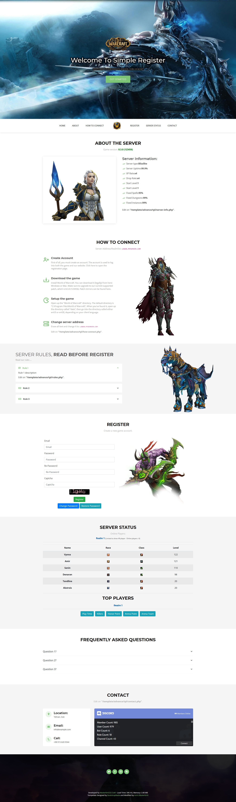

# AzerothCore Registration Portal

A player registration website for an [AzerothCore](https://www.azerothcore.org) (WotLK 3.3.5a) server, packaged to run in Docker behind [Traefik](https://traefik.io) with HTTPS.

It's a single page: server info, how to connect (with [Portalkeeper](#portalkeeper-and-mod-realm-config) setup if you use it), and **Register** / **Change Password** popups in the top menu. It can also show who's online and the top players. Registration only asks for a username and password, and you can close it with one setting so only people you create accounts for can play.

Accounts are written straight into `acore_auth.account` using SRP6 (salt + verifier), the same way AzerothCore does it, so you don't need to enable SOAP.

This is a trimmed-down, Docker-focused fork of [masterking32/WoWSimpleRegistration](https://github.com/masterking32/WoWSimpleRegistration). The PHP and the `advance` template come from that project. See [What's different from upstream](#whats-different-from-upstream).



## Requirements

- **AzerothCore running in Docker** on the same machine. The portal joins AzerothCore's Docker network and connects to the `ac-database` container directly, so no MySQL port has to be exposed.
- **Traefik** running in Docker, with a `websecure` entrypoint and a `letsencrypt` certificate resolver.
- **A DNS record** pointing at the server, e.g. `register.example.com`.
- Docker with the Compose plugin.

## Installation

### 1. Clone the repo on your server

```bash
git clone https://github.com/buildthehomelab/wow-mod-azerothcore-portal.git
cd wow-mod-azerothcore-portal
```

### 2. Create your config files

```bash
cp .env.example .env
cp docker/create-db-user.sql.example docker/create-db-user.sql
```

Both files are gitignored and are not copied into the Docker image.

### 3. Pick a database password

Generate a password, e.g. with `openssl rand -base64 24`. Put it in two places:

- `DB_PASS=` in `.env`
- `CHANGE_ME` in `docker/create-db-user.sql`

### 4. Fill in `.env`

| Variable | What to set |
|---|---|
| `TRAEFIK_NETWORK` | The Docker network Traefik is on (`docker network ls`). |
| `SERVICE_NAME` | Subdomain for the site, e.g. `register`. |
| `DOMAIN` | Your domain, e.g. `example.com`. The site is served at `https://SERVICE_NAME.DOMAIN`. |
| `AC_NETWORK_NAME` | AzerothCore's network. Find it with `docker network ls \| grep ac-network`. It's usually `<azerothcore folder>_ac-network` (on TrueNAS SCALE, `ix-azerothcore_ac-network`). |
| `REALMLIST` | The address players put in `realmlist.wtf`: your server's public IP or hostname. Leave empty to use the address from [mod-realm-config](#portalkeeper-and-mod-realm-config). |
| `REALM_NAME` | Realm name shown on the site. Leave empty to use the name from mod-realm-config. |
| `SITE_TITLE` | Title shown in the browser tab and header. |
| `CONTACT_EMAIL` | Email address shown on the contact page. Leave empty to hide the contact page and its menu link. |
| `PATCH_URL` | Optional. Download link for a client patch, shown in the "How to connect" section. |
| `DISABLE_REGISTRATION` | Set to `true` to close sign-ups: Register disappears from the site and new accounts are refused. See [Managing accounts](#managing-accounts). |
| `RESERVED_USERNAME_PREFIXES` | Comma-separated name prefixes players can't register. Defaults to `RNDBOT`: mod-playerbots treats any account starting with its `AiPlayerbot.RandomBotAccountPrefix` as a bot account and deletes it on the next bot reset. Change it if you changed that prefix; `_` and `%` work as in SQL `LIKE`, the way playerbots matches them. Set it empty (`RESERVED_USERNAME_PREFIXES=`) to refuse no names. |
| `DISABLE_CHANGEPASSWORD` | Set to `true` to remove Change Password from the menu. |
| `DISABLE_ONLINE_PLAYERS` / `DISABLE_TOP_PLAYERS` | Set to `true` to hide the online players list / top players. With both set, the whole Server Status section and its menu link are hidden. |
| `REALM_ID` | The realm's ID in `acore_auth.realmlist`. Leave at `1` unless you run more than one realm. |
| `CAPTCHA_TYPE` | `0` built-in image captcha (default), `1` hCaptcha, `2` reCAPTCHA v2, `3` Cloudflare Turnstile, `4` off. |
| `CAPTCHA_KEY` / `CAPTCHA_SECRET` | Site key and secret key from your captcha provider. Only needed for types 1–3. |
| `DB_USER` / `DB_PASS` | Leave `DB_USER` as `wow_register` unless you changed it in the SQL file. |
| `DB_PORT` | AzerothCore's MySQL port inside the Docker network. Leave at `3306` unless you changed it. |
| `AC_MODULES_DIR` | Optional. AzerothCore's `modules/` folder on the host, so the [patch notes](#patch-notes-changelogphp) only show what the realm runs. |
| `REALM_CONFIG_DIR` | Optional. Host folder mod-realm-config writes `<realm_key>.realm.conf` to. See [below](#portalkeeper-and-mod-realm-config). |
| `DEBUG_MODE` | Set to `true` to show PHP errors while troubleshooting. Turn it back off afterwards. |

### 5. Create the database user

```bash
docker exec -i ac-database mysql -uroot -p < docker/create-db-user.sql
```

It prompts for your AzerothCore MySQL root password. The new `wow_register` user can only read and write `acore_auth.account` and read `acore_characters`. It can't touch anything else.

### 6. Start it

AzerothCore must be up first, because it creates the network the portal joins.

```bash
docker compose up -d --build
```

Open `https://SERVICE_NAME.DOMAIN` and register a test account, then log in with it in the game client. If you want to stop strangers signing up, set `DISABLE_REGISTRATION=true` afterwards and run `docker compose up -d`.

## Portalkeeper and mod-realm-config

If your server runs [mod-realm-config](https://github.com/Hisha/mod-realm-config), the portal can host its `realm.conf` for the [Portalkeeper](https://github.com/Hisha/Portalkeeper) launcher. Players then get a "Play with Portalkeeper" section under **How to connect**. It has a Portalkeeper download link, the `realm.conf` download and where to put it.

The module writes `<realm_key>.realm.conf` to a folder but doesn't serve it over the web. (The module's README calls it `realm.conf`, but the code names it after `realm_key`.) The portal mounts that folder read-only and serves it at `https://SERVICE_NAME.DOMAIN/realm/`.

These steps assume AzerothCore runs from the [azerothcore-wotlk](https://github.com/azerothcore/azerothcore-wotlk) repo's own `docker-compose.yml`, checked out at `~/azerothcore-wotlk`. Adjust the paths if yours is somewhere else.

1. **Add the module and rebuild AzerothCore.** The Docker build compiles everything in `modules/`:

   ```bash
   cd ~/azerothcore-wotlk/modules
   git clone https://github.com/Hisha/mod-realm-config.git
   ```

2. **Create the output folder.** Worldserver runs as UID 1000 (`DOCKER_USER_ID`), so it has to own the folder. If Docker creates the folder instead, root owns it and the module can't write to it.

   ```bash
   mkdir -p ~/azerothcore-wotlk/env/dist/realm-public
   sudo chown 1000:1000 ~/azerothcore-wotlk/env/dist/realm-public
   ```

3. **Mount it into worldserver.** AzerothCore says not to edit its `docker-compose.yml`, so create `~/azerothcore-wotlk/docker-compose.override.yml` (or add to yours):

   ```yaml
   services:
     ac-worldserver:
       volumes:
         - ./env/dist/realm-public:/azerothcore/env/dist/realm-public
   ```

4. **Configure the module.** Copy `modules/mod-realm-config/conf/mod_realm_config.conf.dist` to `env/dist/etc/modules/mod_realm_config.conf` and set:

   ```ini
   RealmConfig.OutputDirectory = "/azerothcore/env/dist/realm-public/"
   ```

5. **Rebuild and start AzerothCore:**

   ```bash
   cd ~/azerothcore-wotlk
   docker compose up -d --build
   ```

   The `ac-db-import` container should create the module's tables in `acore_world`. If `SHOW TABLES LIKE 'mod_realm_config%';` in `acore_world` comes back empty, import `modules/mod-realm-config/data/sql/db-world/base/mod_realm_config.sql` into `acore_world` yourself. It's safe to run twice.

6. **Fill in your realm's details** in the world database. `address` is what players connect to. `realm_key` names the file (lowercase letters, digits, `-` or `_`). The module starts it at `example`, which is why you get `example.realm.conf`. Use your own key, hostname and the portal's URL:

   ```sql
   UPDATE acore_world.mod_realm_config
   SET realm_key   = 'myrealm',
       name        = 'My Realm',
       address     = 'wow.example.com',
       auth_port   = 3724,
       world_port  = 8085,
       config_url  = 'https://register.example.com/realm/myrealm.realm.conf',
       website_url = 'https://register.example.com/'
   WHERE id = 1;
   ```

   The module notices the change within `RealmConfig.RefreshIntervalSeconds` (30s by default) and writes `myrealm.realm.conf`. There's no need to restart anything. If you changed the key, the module leaves the old `example.realm.conf` in place, so delete it.

7. **Point the portal at the folder** in this repo's `.env` (an absolute host path), then restart the portal:

   ```bash
   REALM_CONFIG_DIR=/home/you/azerothcore-wotlk/env/dist/realm-public
   ```

   ```bash
   docker compose up -d
   ```

   Open `https://SERVICE_NAME.DOMAIN/realm/myrealm.realm.conf`. It should show the file. The portal uses the newest `*.realm.conf` in the folder. To pin a specific one, set `REALM_KEY=myrealm` in `.env`.

   With this compose file, `AC_NETWORK_NAME` is `<folder name>_ac-network`, e.g. `azerothcore-wotlk_ac-network`. Check with `docker network ls`.

With `REALMLIST` and `REALM_NAME` left empty in `.env`, the site uses the realm's address and name from `realm.conf`, so you only have to set them in one place.

Everything in that folder is public, so only point it at a folder that holds public files. Other modules that write public files there, such as the [armory](#armory-mod-realm-armory) or a news feed, are served at `/realm/<file>` too. Directory listings and PHP are turned off for that path. The files need to be readable by other users (e.g. mode `644`) so the web server can read them.

### Armory (mod-realm-armory)

[mod-realm-armory](https://github.com/Hisha/mod-realm-armory) publishes a character roster (`index.json`) and one profile per character (`characters/<guid>.json`) for Portalkeeper's Armory tab. Like mod-realm-config, it only writes files. Have it write into an `armory` folder inside the same `realm-public` folder, and the portal serves them at `https://SERVICE_NAME.DOMAIN/realm/armory/`. No portal changes or extra mounts are needed.

1. **Add the module** next to mod-realm-config and rebuild AzerothCore:

   ```bash
   cd ~/azerothcore-wotlk/modules
   git clone https://github.com/Hisha/mod-realm-armory.git
   ```

2. **Configure it.** Copy `modules/mod-realm-armory/conf/mod_realm_armory.conf.dist` to `env/dist/etc/modules/mod_realm_armory.conf` and set the output folder. The shipped file has someone else's path in it, so this line has to change:

   ```ini
   RealmArmory.OutputDirectory = "/azerothcore/env/dist/realm-public/armory"
   RealmArmory.IncludePlayerbots = 0
   ```

   `IncludePlayerbots = 0` keeps playerbots out of the roster. Leave the other settings at their defaults unless you need them.

3. **Rebuild and start AzerothCore** with `docker compose up -d --build`. The module publishes on startup and then every 15 minutes (`RealmArmory.UpdateIntervalMinutes`). To publish right away, type `realmarmory publish` in the worldserver console.

4. **Point Portalkeeper at it** through mod-realm-config, so it shows up in players' realm file:

   ```sql
   UPDATE acore_world.mod_realm_config
   SET armory_url = 'https://register.example.com/realm/armory/index.json'
   WHERE id = 1;
   ```

5. **Check it:** open `https://SERVICE_NAME.DOMAIN/realm/armory/index.json` in a browser. You should see the roster, and your `.realm.conf` should now have `ArmoryURL=` set under `[Services]`.

The module doesn't delete profile files for characters that are deleted or drop out of the roster, so `characters/<guid>.json` for those stays reachable until you remove it from `realm-public/armory/characters/`. Character names, gear and appearance are public by design. No account names, emails or IPs are included.

## Launcher login and client download

The portal can also back the Portalkeeper launcher (our fork, [wow-Portalkeeper](https://github.com/buildthehomelab/wow-Portalkeeper)) with three things:

- **Login:** players sign in to the launcher with their game account. The password is checked against the account's SRP6 verifier, and the launcher gets a token that lasts `LAUNCHER_TOKEN_DAYS` (30) from its last use. Only the token's SHA-256 is stored. Failed logins are throttled: 5 per account name and 20 per address every 15 minutes. Banned accounts are refused.
- **A private BitTorrent tracker** for the client download. It only tracks the torrents in `LAUNCHER_TORRENT_DIR`, and only gives peers to logged-in players. Players behind the same router get each other's home-network address first, so a copy in the next room beats the internet. Players on the server's own network are only handed to each other, unless you set `LAUNCHER_PUBLIC_ADDRESS` (see below).
- **A web seed** that serves the client files over HTTPS with byte ranges, so a download never stalls when no other player is sharing.
- **Patch torrents:** every patch MPQ in the realm folder (`/realm/`) gets its own torrent, so players share patches with each other too. The realm folder stays the source of truth. Upload a new `patch-X.MPQ` as usual: the portal builds a new torrent from it the first time someone asks, and stores it in the database per file size and modification time. The web seed is the patch's normal `/realm/` URL, and Portalkeeper still checks the SHA-256 from realm.conf.

It's off until you set `LAUNCHER_ENABLED=true`.

With it on, the home page's "How to connect" shows three steps instead of the manual realmlist checklist: register, download the launcher (`LAUNCHER_DOWNLOAD_URL`, default the fork's latest GitHub release), then INSTALL WOW and ENTER REALM.

| Endpoint | What it does |
| --- | --- |
| `POST api/launcher/login.php` | `{"username", "password"}` (JSON or form) → `{"token", "expires_at", "account": {"id", "name"}}` |
| `GET api/launcher/session.php` | Who the token belongs to. 401 when it has expired, 403 for banned accounts. |
| `POST api/launcher/logout.php` | Forgets the token. |
| `GET api/launcher/torrent.php` | Lists the torrents. `?name=client` returns `client.torrent` rewritten for this player. |
| `GET api/launcher/patch-torrent.php?file=patch-P.MPQ` | The torrent for one patch in the realm folder |
| `api/launcher/announce.php/<passkey>` | Tracker announce URL, inside the player's torrent |
| `api/launcher/seed.php/<passkey>/` | Web seed URL, inside the player's torrent |

Send the token as `Authorization: Bearer <token>`. Each player's torrent carries their own passkey in the announce and web seed URLs. Those sit outside the torrent's info dictionary, so every player still has the same info hash and joins the same swarm.

### Setting it up

1. **Database:** run the launcher lines of [docker/create-db-user.sql.example](docker/create-db-user.sql.example) as root. They create `acore_launcher` and let the portal user read `acore_auth.account_banned`. The portal creates its tables on first use.
2. **Files:** copy a clean 3.3.5a client to a folder on the host, for example `/srv/wow-launcher/client/Evermore/`. The folder's name becomes the torrent's name and the folder players get. Then build the torrent:

   ```bash
   python3 tools/make-client-torrent.py /srv/wow-launcher/client/Evermore /srv/wow-launcher/torrents/client.torrent \
       --realm-conf <REALM_CONFIG_DIR>/azeroth.realm.conf
   ```

   It leaves out what the launcher or the game writes to (`realmlist.wtf`, `WTF`, `Cache`, `Logs`, `Interface`), so players' copies keep matching and keep being shared. With `--realm-conf` it also leaves out the realm's own patches (every `[Patch.*]` `FileName`), which come from the realm folder through their own torrents. Everything else stays in, including a graphics client's own `patch-X.MPQ` files when you base the client on an HD repack. Run it again only when the client files themselves change. A new client torrent means everyone downloads the changed files again.
3. **`.env`:** set `LAUNCHER_ENABLED=true`, `LAUNCHER_TORRENT_DIR=/srv/wow-launcher/torrents` and `LAUNCHER_CLIENT_DIR=/srv/wow-launcher/client`, then run `docker compose up -d`.

Patch torrents need nothing extra: they use the realm folder the portal already serves. Override `LAUNCHER_PATCH_DIR` (default `/var/www/html/realm`) or `LAUNCHER_PATCH_URL` (default `/realm` on the seed host, see below, or on `BASE_URL`) only if the patches live somewhere else.

Check it with `curl -X POST -d 'username=you&password=...' https://SERVICE_NAME.DOMAIN/api/launcher/login.php`.

The tracker reads the player's address from the last `X-Forwarded-For` entry, which Traefik adds. That entry is only trusted when the request comes from a private address (Traefik on the Docker network). If you put another proxy such as Cloudflare in front of Traefik, every player shows up with the proxy's address, peers get handed addresses nobody can connect to, and the login throttle counts all players as one address.

### Behind Cloudflare

**Through a cloudflared tunnel or the Cloudflare proxy:** set `LAUNCHER_CLIENT_IP_HEADER=CF-Connecting-IP` in `.env` and run `docker compose up -d`. Cloudflare puts the player's address in that header, so the tracker and the login throttle use it. It's only read on requests that came from a private address (Traefik), and only set it when every outside request reaches Traefik through Cloudflare, since Cloudflare overwrites the header but a client talking to Traefik directly could send its own. Requests without the header, such as players on your own network going straight to Traefik, fall back to `X-Forwarded-For`.

The web seeds then also go through Cloudflare. Check that Cloudflare's terms allow that much traffic on your plan; players sharing with each other takes most of it off the web seed once a few have the client.

**Sharing from the server's own network:** a launcher on the same network as the server talks to Traefik directly, so the tracker sees its private address and can't hand it to outside players. Set `LAUNCHER_PUBLIC_ADDRESS` to the network's public IP or a host name that resolves to it (your realmlist, e.g. `realm.example.com`; the container has to resolve it to the public address, not a local override). Outside players then get those launchers at that address. Their router has to forward the launcher's port to them: turn on UPnP (the launcher asks for it) or forward the port by hand. Players on that network who come in through Cloudflare (same public address) are treated as being on it.

**With an open port instead:** give the tracker and web seeds a host of their own that reaches Traefik directly:

1. Add a DNS-only record (grey cloud in Cloudflare), for example `seed.example.com`, pointing at the server's public address. Port 443 has to reach Traefik, and Let's Encrypt has to be able to issue a certificate for the host (port 80 too if your resolver uses the HTTP challenge).
2. Set `LAUNCHER_SEED_HOST=seed.example.com` in `.env` and run `docker compose up -d`.

Torrents handed out from then on announce to `https://seed.example.com/api/launcher/announce.php/<passkey>` and use the web seeds there (`seed.php` for the client, `/realm/` for patches), so the tracker sees players' real addresses and the big downloads skip the proxy. Login and the torrent files themselves stay on the main host. The seed host only answers the tracker, web seed and `/realm/` paths; the rest of the site isn't reachable through it. If your router doesn't loop public addresses back to the LAN, add a local DNS record for the seed host on your network too.

## Rare map (mod-rare-tracker)

`rares.php` is a live map of every open-world rare that's up right now. It has continent and zone
maps, a searchable list per zone, and respawn countdowns for dead rares. The data comes from
[mod-rare-tracker](https://github.com/buildthehomelab/wow-mod-rare-tracker), which the worldserver
serves from memory on the AzerothCore Docker network. `api/rares.php` passes it through to the
browser, so the worldserver needs no published port.

1. **Add the module** and rebuild AzerothCore (see its README). Its endpoint is
   `http://ac-worldserver:8095/rares.json` by default.
2. **Point the portal at it** in `.env`, then `docker compose up -d`:

   ```ini
   RARE_TRACKER_URL=http://ac-worldserver:8095/rares.json
   ```

   A **Rare Map** link appears in the top menu. Leave `RARE_TRACKER_URL` empty to hide the page.
3. **Add the map images** (optional but recommended). Build them from your WoW client with the
   module's `tools/build_worldmaps.py`, and copy the resulting `worldmap` folder into
   `REALM_CONFIG_DIR`, so they're served at `/realm/worldmap/`. Set `WORLDMAP_URL` to serve them
   from somewhere else. Without them, rares are listed and placed on a plain grid.

The page polls every 30 seconds while it's open. The worldserver only rebuilds the list while
someone is looking.

## Patch notes (changelog.php)

`changelog.php` is a patch-notes page in the style of Blizzard's: one post per day, grouped into
Classes (in class colours), Professions, Auction House, Dungeons and so on, with New Features and
Bug Fixes sections and a category filter. It's built from **merged pull requests** in every repo
of a GitHub user or organization, so nothing has to be written twice.

1. **Turn it on** in `.env`, then `docker compose up -d`:

   ```ini
   CHANGELOG_ORG=buildthehomelab
   CHANGELOG_TIMEZONE=America/New_York
   ```

   A **Patch Notes** link appears in the top menu. Only repos whose names match
   `CHANGELOG_REPOS` (default `^(wow-|mod-)`) are read; archived repos are skipped.

2. **Only show what the realm runs** (recommended). Set `AC_MODULES_DIR` to AzerothCore's
   `modules/` folder on the host, then `docker compose up -d`:

   ```ini
   AC_MODULES_DIR=/home/you/azerothcore-wotlk/modules
   ```

   It's mounted read-only, and the portal reads each module's checked-out commit from its `.git`
   folder. A server module's
   changes then appear once the server is on a commit that includes them, and modules the server
   doesn't run don't appear at all. Addons, the launcher and this website (`CHANGELOG_UNGATED`)
   show as soon as they're merged. Without `AC_MODULES_DIR`, everything shows as soon as it's
   merged. To read the versions from somewhere else, set `CHANGELOG_MANIFEST` to a `modules.tsv`
   file (folder, url, branch, commit) or `owner/repo:path/modules.tsv` on GitHub.

### Where the text comes from

For each merged PR, the first of these that exists:

1. **[application/changelog-notes.json](application/changelog-notes.json)**, hand-written notes
   keyed `repo#number`. `{"hide": true}` drops a PR. Repo launches can be written here too, under
   `launches`.
2. **A `## Patch Notes` section in the PR description.** Its bullets are used as they are, and a
   `>` quote becomes a "Developers' notes" box. Write `None` to keep a PR off the page.

   ```markdown
   ## Patch Notes
   - **Travel Form** can now be used indoors.
   - Fixed an issue where **Travel Form** dropped below 40% speed indoors.
   > We want druids to keep their travel form in caves and cities.
   ```

3. **The PR title.** Titles that look like version bumps, docs, build or compatibility fixes
   are skipped.

Each repo is also announced once as a **New Feature**, dated when the repo was created. The card
comes from `launches` in `changelog-notes.json`, or else from a `## Patch Notes` section in the
repo's README. The heading carries the feature's name, and an optional `Category:` line picks the
section (and class):

```markdown
## Patch Notes: Bear Fishing
Category: Classes / Druid
- Druids can now fish in Bear Form: wade into a river and swipe salmon out of the water.
> We wanted druids to have a reason to visit the rivers of Azeroth.
```

Repos with neither aren't announced. READMEs are only fetched again after a push to the repo.

Notes take their category from the repo name (see `CL_REPO_SECTIONS` in
[application/include/changelog.php](application/include/changelog.php)). A `Category:` line in a
`## Patch Notes` section, or `section` and `sub` in `changelog-notes.json`, override it. A note is listed under Bug Fixes when the PR title starts with
"Fix", every bullet starts with "Fixed", or `fix` is set.

GitHub's answers are cached for `CHANGELOG_CACHE_SECONDS` (10 minutes), and the old copy is kept
if GitHub is down. The first load after a restart looks up every module's commit and can take
half a minute; after that, commit dates are remembered. Without `GITHUB_TOKEN`, GitHub allows 60
requests an hour, which is enough once the cache is warm.

## Managing accounts

With `DISABLE_REGISTRATION=true`, create accounts yourself from the worldserver console:

```bash
docker attach ac-worldserver
```

Then type the command and detach with **Ctrl+P, Ctrl+Q** (Ctrl+C stops the server):

| To | Command |
|---|---|
| Create an account | `account create <username> <password>` |
| Reset a forgotten password | `account set password <username> <new> <new>` |

Players can change their own password on the site if they know the current one. There's no "forgot password" email because the portal doesn't send email.

## Updating

```bash
git pull
docker compose up -d --build
```

If you only changed `.env` (title, contact email, closing registration and so on), `docker compose up -d` is enough and no rebuild is needed.

## Troubleshooting

- **Blank page:** set `DEBUG_MODE=true` in `.env`, run `docker compose up -d`, reload the page and read the error. Then turn it off again.
- **Styling or images missing:** the site builds its links from `SERVICE_NAME` and `DOMAIN`. Make sure they match the URL you're visiting.
- **Database connection error:** check that `AC_NETWORK_NAME` is right, that the container is on it (`docker inspect wow-register`), and that `DB_PASS` matches the password in `create-db-user.sql`.
- **No Portalkeeper section / 404 on `/realm/<realm_key>.realm.conf`:** check that `REALM_CONFIG_DIR` is the host folder the module writes to, that `<realm_key>.realm.conf` exists there (and matches `REALM_KEY` if you set it) and is readable, and that you ran `docker compose up -d` after changing it. `docker exec wow-register ls -l /var/www/html/realm` shows what the container sees.
- **Logs:** `docker logs wow-register`

## What's different from upstream

- Docker image (PHP 8.3 + Apache) with Composer dependencies installed at build time.
- **Dark theme** inspired by the World of Warcraft site: warm dark backgrounds, parchment serif headings, bronze trim and teal buttons. It's one stylesheet, [template/advance/assets/css/forever.css](template/advance/assets/css/forever.css), loaded after the template's own CSS, so it's easy to tweak or remove.
- **One template, English only.** Only `advance` is included (upstream's other six templates and 11 translations were removed). Register and Change Password are popups in the top menu. The placeholder FAQ, rules, footer, contact details and "Edit on …" hints are gone, and the server info lists this server's actual rates and features ([template/advance/tpl/server-info.php](template/advance/tpl/server-info.php)).
- **Registration can be closed** with `DISABLE_REGISTRATION`, which hides the form and makes the server refuse sign-ups.
- All config comes from environment variables ([docker/config.php](docker/config.php)) instead of an edited `config.php`.
- Served only through Traefik over HTTPS. No ports are published.
- Apache blocks direct access to `application/`, `docker/`, dotfiles and Markdown files ([docker/apache-security.conf](docker/apache-security.conf)).
- Locked to AzerothCore with SRP6, using a least-privilege database user instead of root.
- Uses the built-in image captcha by default, so there are no third-party captcha keys to set up. You can switch to hCaptcha, reCAPTCHA or Turnstile with `CAPTCHA_TYPE`.
- Can host [mod-realm-config](https://github.com/Hisha/mod-realm-config)'s `realm.conf` and [mod-realm-armory](https://github.com/Hisha/mod-realm-armory)'s JSON for Portalkeeper, and shows Portalkeeper setup steps.
- **Launcher API** ([api/launcher/](api/launcher/)): game-account login for Portalkeeper, plus a private tracker and web seed for the client download.
- **Rare map** ([rares.php](rares.php)): live open-world rares from mod-rare-tracker on the game's own maps.
- **Patch notes** ([changelog.php](changelog.php)): Blizzard-style patch notes built from merged pull requests on GitHub.
- **Vote system is off,** because it alters `acore_auth.account` and creates new tables.
- **No email.** Registering only asks for a username and password, and accounts get an empty email. "Restore password" and two-factor auth are turned off because they need SMTP. See [Managing accounts](#managing-accounts) for resetting passwords.

## Credits

Author: [buildthehomelab](https://github.com/buildthehomelab)

Built on [WoWSimpleRegistration](https://github.com/masterking32/WoWSimpleRegistration) by [Amin.MasterkinG](https://masterking32.com) and its contributors and translators. See the upstream README for the full list.

## License

Licensed under the GPL-3.0, the same as upstream. See [LICENSE](LICENSE).
